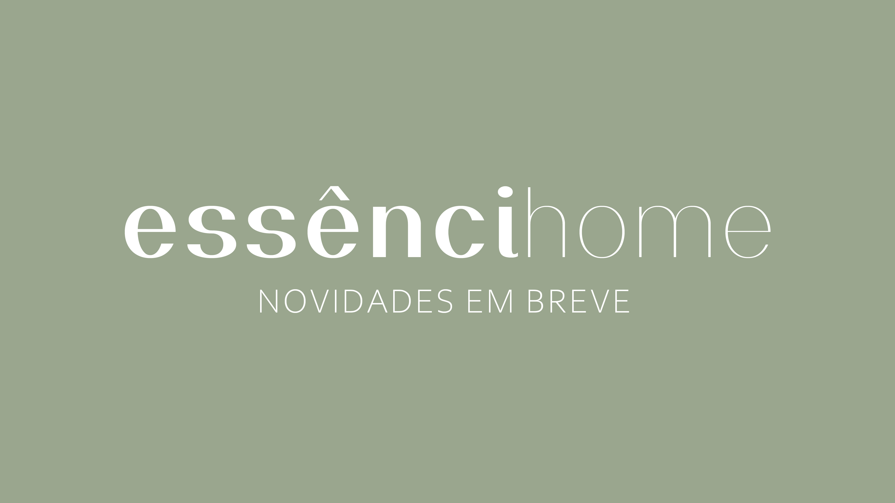

<!DOCTYPE html>
<html lang="en">
<head>
<title>Essênci Home</title>
<meta charset="UTF-8">
<meta name="viewport" content="width=device-width, initial-scale=1">

<head>
    <link rel="icon" href="Imagens/icone.jpg">
</head>
<body>

   

</body>
</html>
